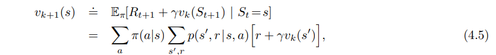
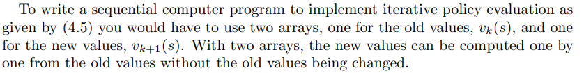
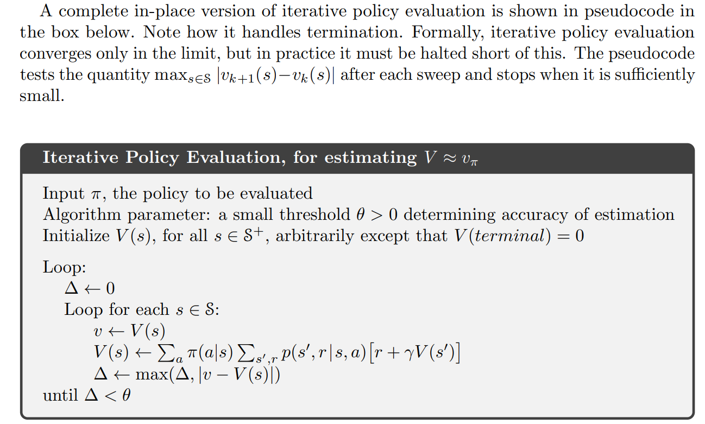

# DP
### Modify the gridworld you created last week to create a 4x4 version  

• No obstacles  
• Rewards of -1 on all transitions  
• Goal in the top left corner – entering the goal state ends the episode  

### 1. First we consider how to compute the state-value function  for an arbitrary policy 

Given this environment and a uniform random policy, implement 2 versions of policy evaluation: 
(For both versions: The initial approximation, , is chosen
arbitrarily (except that the terminal state, if any, must be given value 0) 
**Version 1**  
A two-array version, which only updates the value function after looping through all states 

**Version 2**  
• An in-place version with a threshold value of 𝜃 = 0.01  

• NB: Careful of how you handle the terminal state!!   
• For a given 𝛾, record the number of iterations of policy evaluation until convergence  

**Submit**
1. A 2d heatmap plot of the value function for 𝛾 = 1
2. A combined plot of both versions of policy evaluation for different discount rates
1. The 𝑥-axis should be the discount rate. The range of discounts should be specified by np.logspace(- 0.2, 0, num=20)
2. The 𝑦-axis should be the number of iterations to convergence
